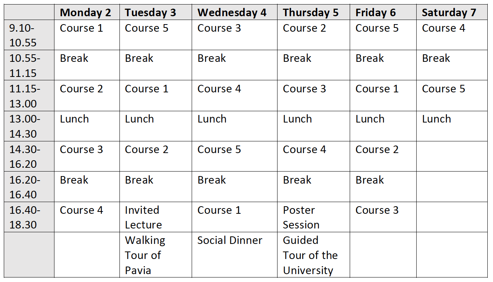

# Course Schedule 📋

## Courses and instructors 

- Course 1: Anatolian - Guglielmo Inglese (University of Turin)
- Course 2: Mycenaean - Daniel Kölligan (Julius-Maximilians-Universität Würzburg)
- Course 3: Avestan - Benedikt Peschl (Freie Universität Berlin)
- Course 4: Italic - Michael Weiss (Cornell University)
- Course 5: Comparative Indo-European poetics - Riccardo Ginevra (UCSC Milan)
  
- Invited lecture: The Yamnaya Impact on Prehistoric Europe - Volker Heyd (University of Helsinki)

## Schedule

